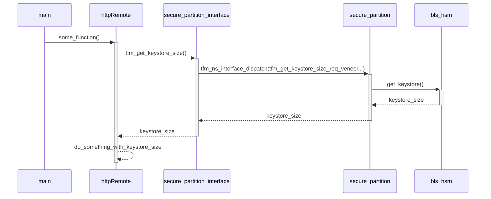

# Secure Partition
In order to store the keys in a secure memory partition, TF-M is used, which allows the use of ARM TrustZone. This involves a modification to the flow of calls to the `bls_hsm` functions.

`cli` uses `bls_hsm_ns` to call `bls_hsm` functionality. When TF-M is disabled, `bls_hsm_ns` directly calls the functions of `bls_hsm` (which contain all the functionalities used from blst library). When TF-M is enabled, `bls_hsm_ns` calls the `secure_partition_interface` functions, which are responsible for calling the functions running in a secure partition that are in `secure_partition`. It's `secure_partition` which, from the secure world, calls `bls_hsm` functions.

`remote-signer` uses `bls_hsm` functions from `httpRemote`. The function call flow is the same as for `bls_hsm_ns`.

The sequence diagrams below show which keygen calls are made, depending on whether or not TF-M is used.

## Sequence diagram of keygen when TF-M is not enabled (cli)

## Sequence diagram of keygen when TF-M is enabled (cli)

## Sequence diagram of get_keystore_size when TF-M is enabled (remote-signer)
